# Lab 6 - Microservices

## Author

* **Víctor Peñasco** - [vpec](https://github.com/vpec)

## Task report

### Registration server

First, the Eureka registration service is launched.

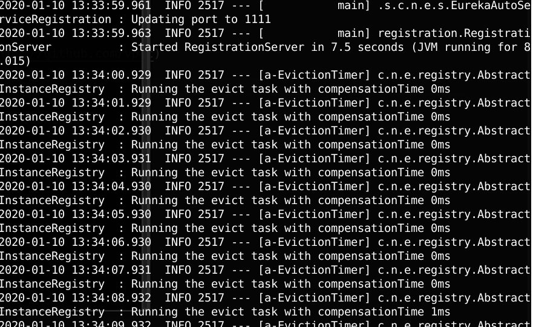

Euroka dashboard can be accessed on localhost port 1111.

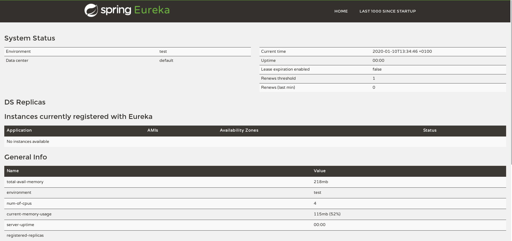

### Accounts microservice

Second, the accounts service is launched. As you can see, it is automatically registered by the Eureka registration service.

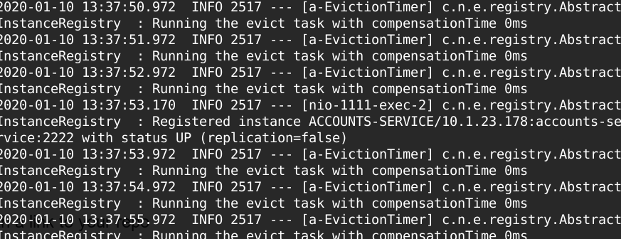

It can be accessed on localhost port 2222.

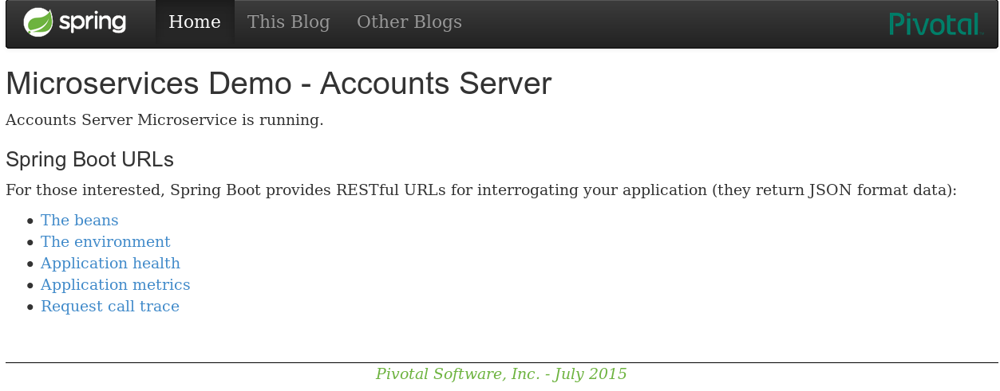

### Web server

Third, the web server is launched. As you can see, it is automatically registered by the Eureka registration service.

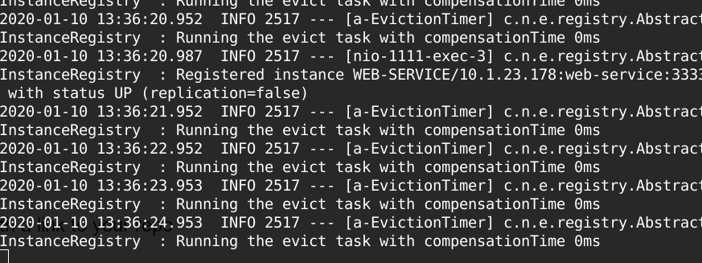

It can be accessed on localhost port 3333.

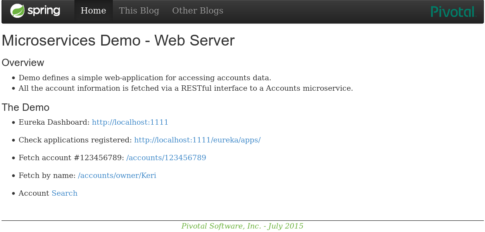

Now, Eureka dashboard shows both microservices: accounts and web server.

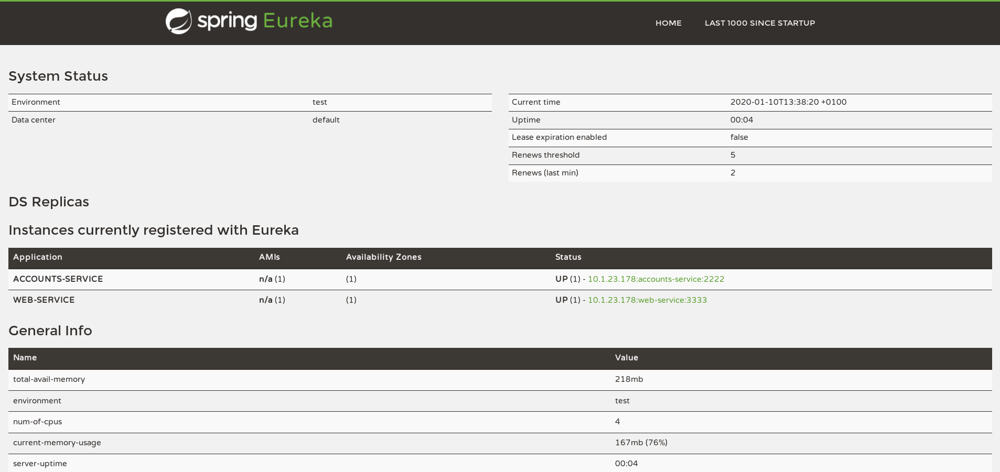

### Another accounts microservice

Fourth, a second accounts microservice is launched. As you can see, it is automatically registered by the Eureka registration service.

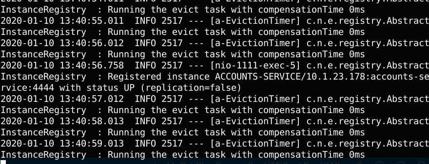

It can be accessed on localhost port 4444.

Now, Eureka dashboard shows 1 web server registered and 2 accounts services (one is a replica).

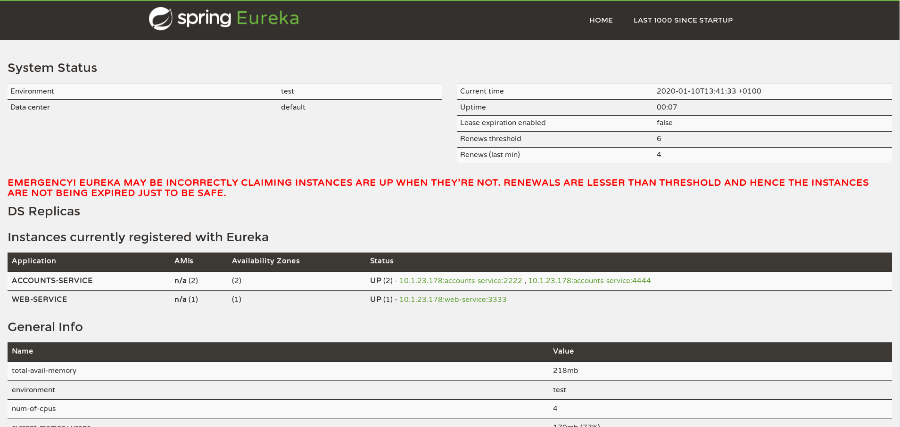

### Kill first accounts microservice

The accounts service that was launched in first place is killed. Eureka registers in its logs this issue.

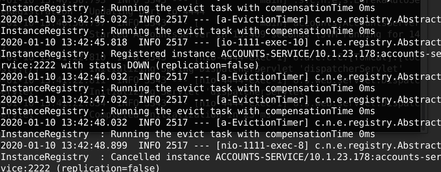

If you update Eureka dashboard, you can see that indeed it has updated the instances information.

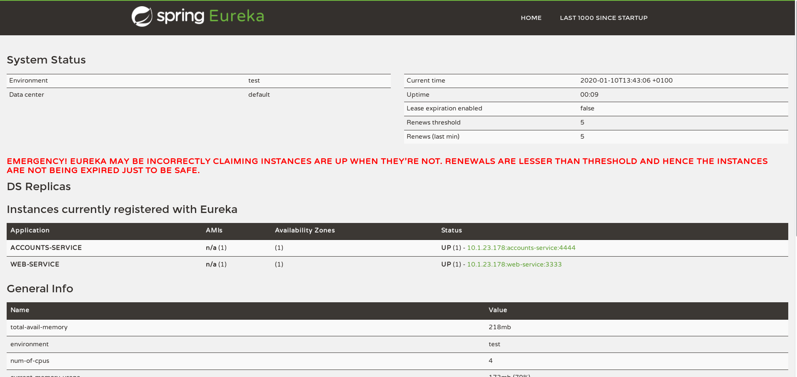

BUT, when you try to access to accounts information through the web server, the information can still be retrieved because the accounts service in port 4444 has replaced the one in 2222.

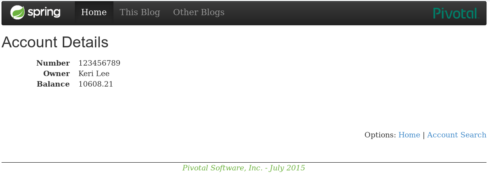

